### 基于ace-admin的智慧床垫管理云平台

#### 一、项目细节展示：
如下为该管理云平台的登陆界面，该平台具有权限管理的功能，当用户输入用户名为`admin`，密码为`123`时，进入超级管理员的首页界面下。

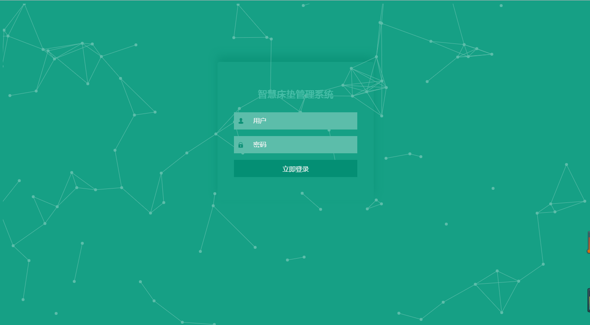

以下为超级管理员的首页界面。

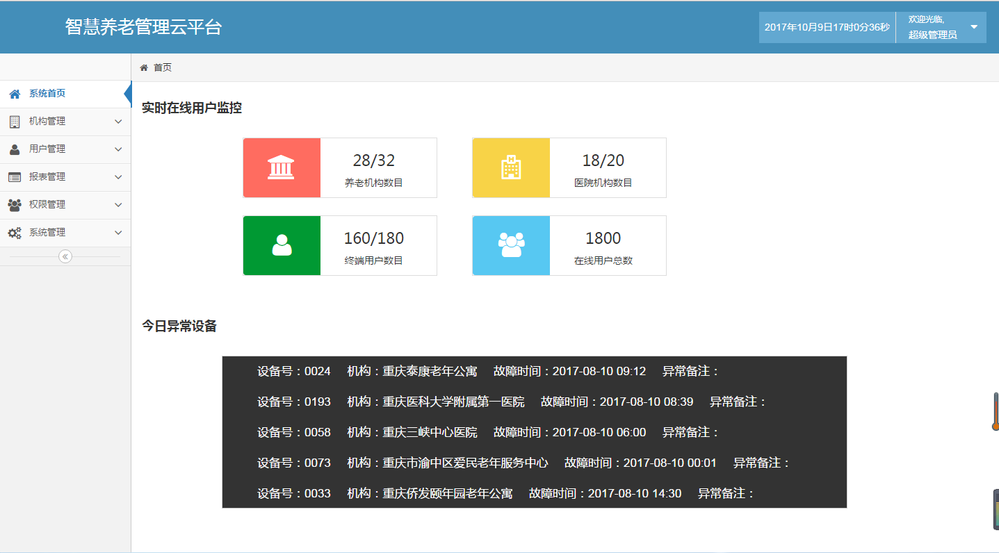

在机构管理菜单项下，可以查询到该平台下属的所有医院与养老院的信息列表。

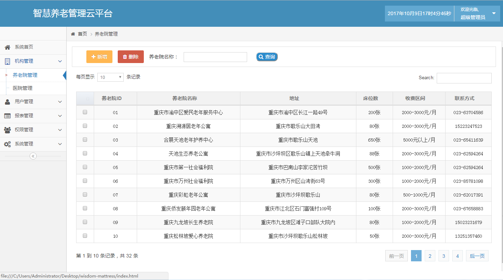

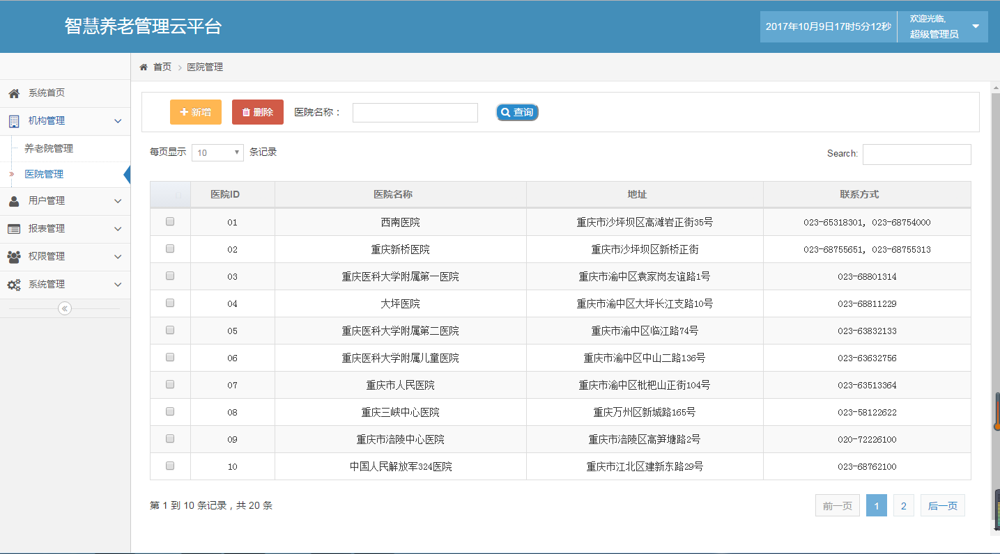

在用户管理菜单项下，分为机构用户管理与终端用户管理，点击机构用户管理，可以在页面上方，进行机构类别与机构`id`号的选择，点击查询按钮，即可罗列出该机构下的所有用户的信息。

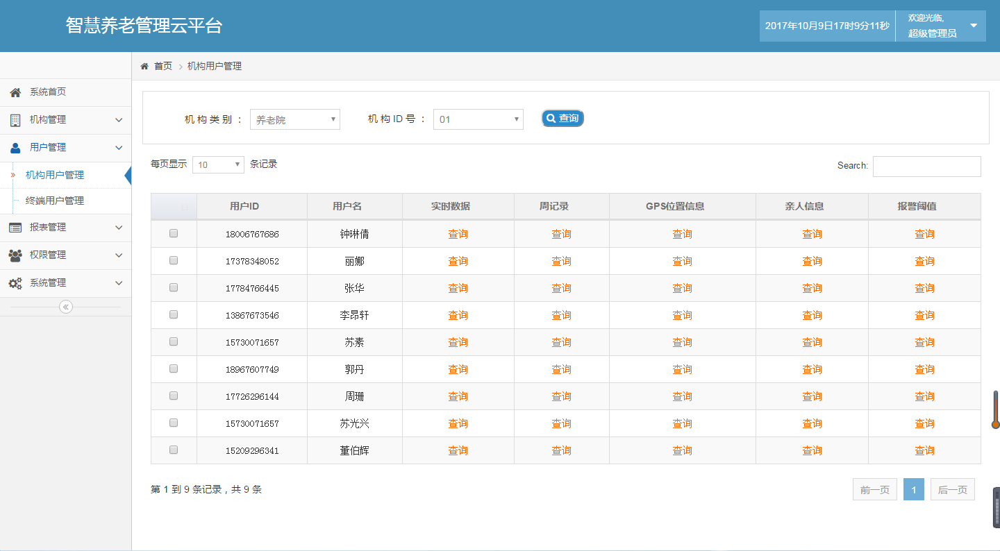

在该用户信息列表当中，点击所要查询的某一项，即可以弹出框的形式呈现具体的数据图表。

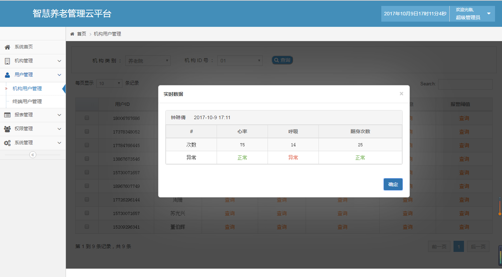

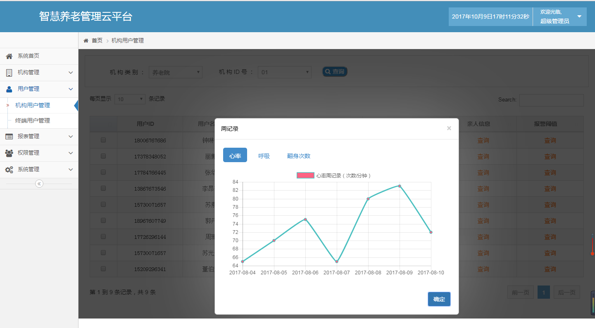

当选择点击GPS位置信息查询，即可进入如下界面，调用百度地图，点击左侧栏的查询位置信息，即可以以`ajax`的方式，向`http://localhost/wisdom-mattress-3/get-gpsinfo.php`请求最新的位置信息，获取到经纬度后，以标志点的方式在地图上呈现。

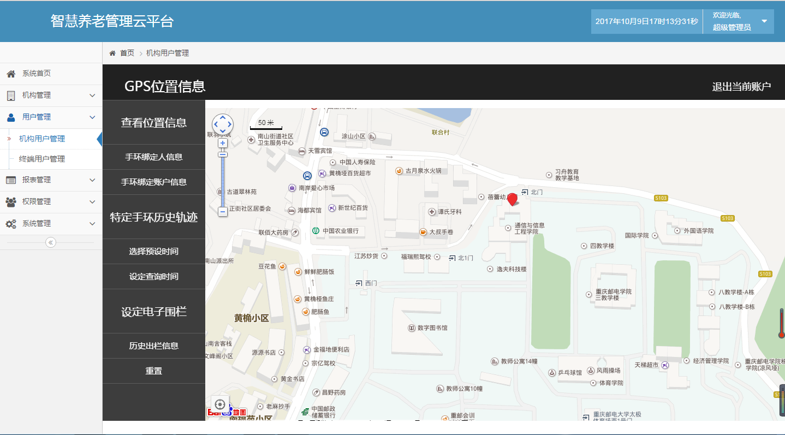

当选择点击设定电子围栏，则可以在地图上任意点处点击，即可在弹出的弹出层内输入所要设定的围栏大小，点击确定后即可在地图上设定电子围栏。

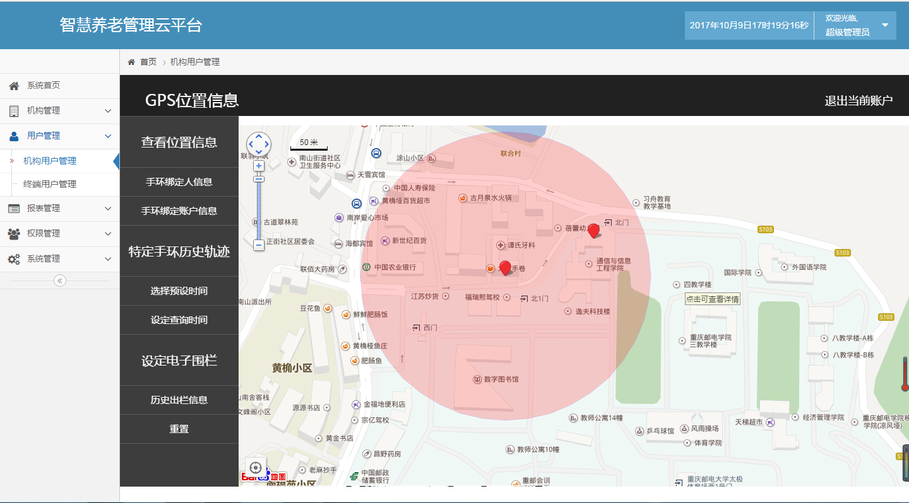

点击重置，即可删掉设定的围栏图标。点击退出当前账户，即可完成退出。
在终端用户管理界面上，可以输入用户的`ID`号，并选择所要查询的类别，点击查询，即可呈现用户的信息数据。

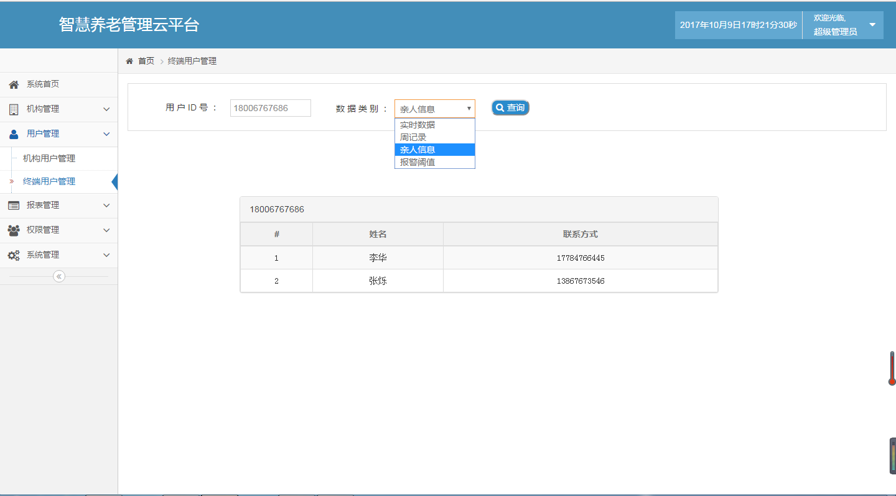

在超级管理员的界面下，当选择点击导航栏右侧的下拉菜单中的安全退出，即可返回登陆界面。此时在该登陆界面下输入用户名为`nursing`，密码为`123`即可进入机构管理员的首页界面。

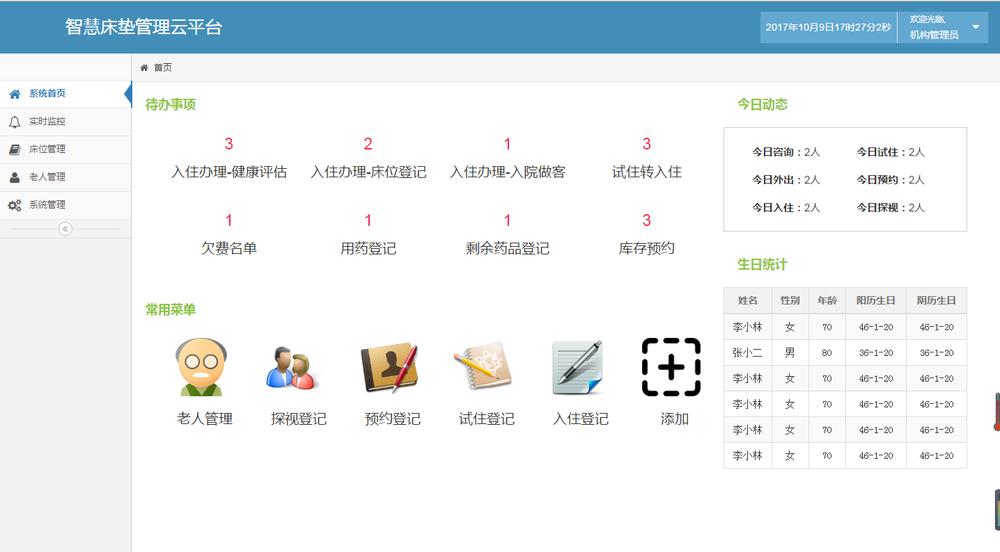

当选择点击实时监控的菜单项时，呈现的界面为：

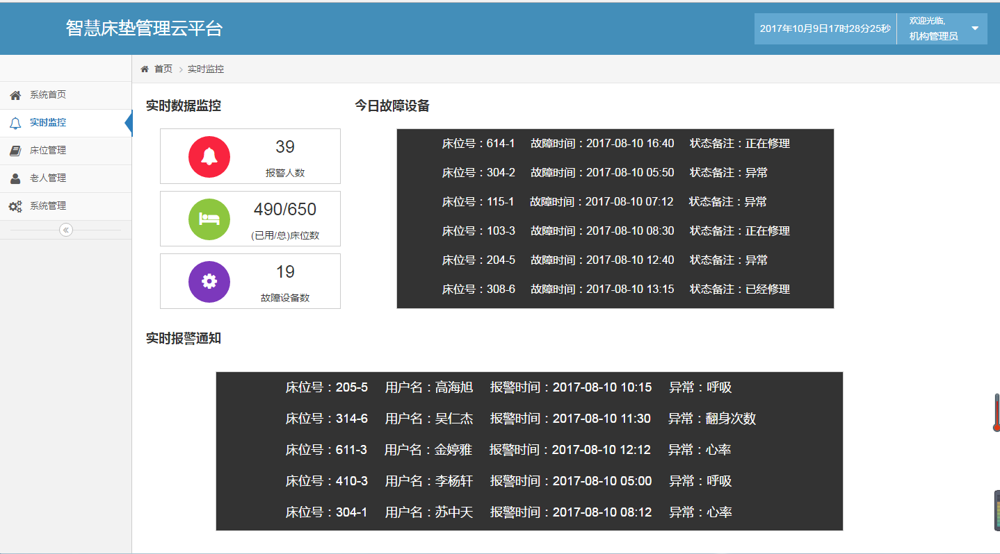

当选择点击床位管理的菜单项时，呈现的界面为：

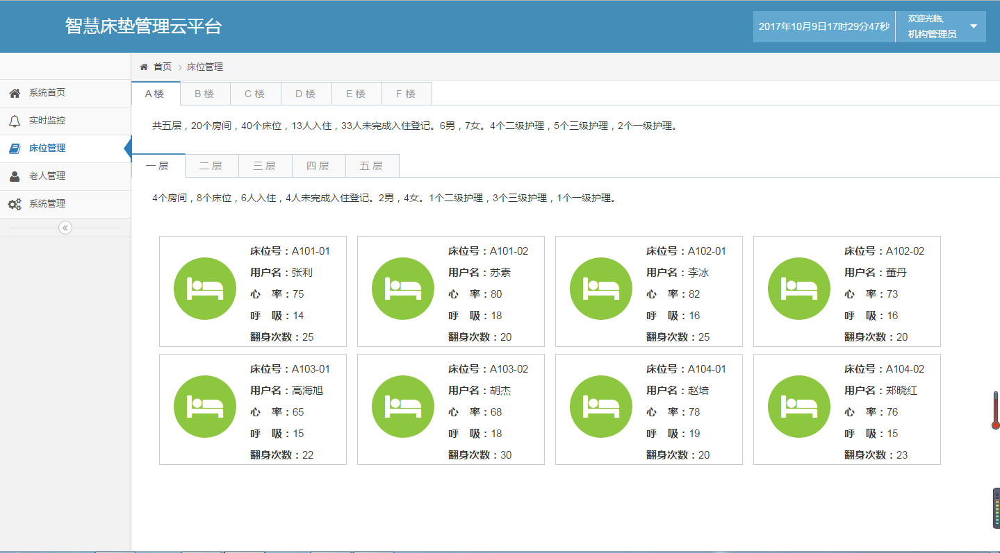

当选择点击老人管理的菜单项时，呈现的界面为：

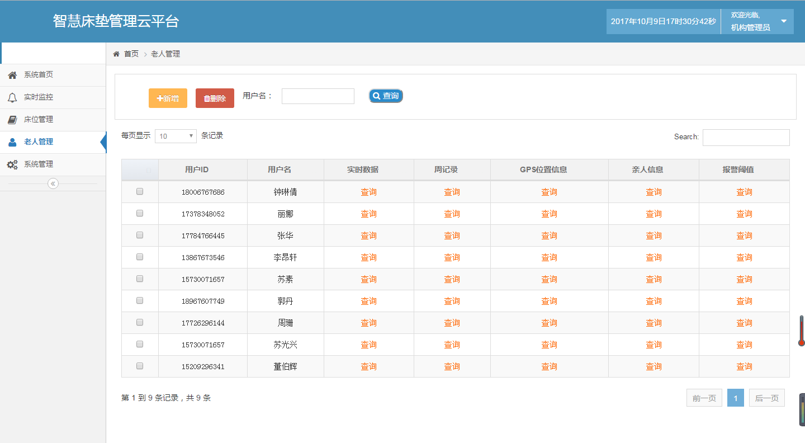
